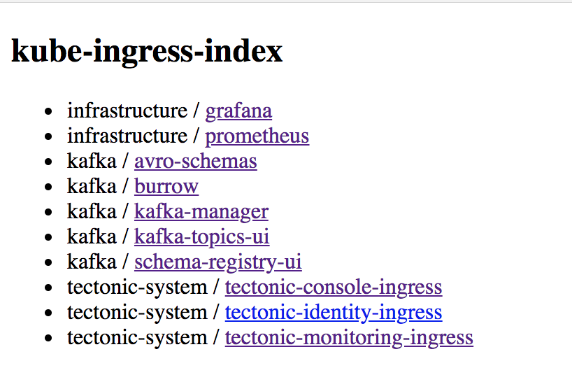

## kube-ingress-index

A serivce which generates a Table of Contents page from `Ingress` resources and updates itself when Ingresses are changed, added, or deleted.



```
$ ./kube-ingress-index -kubeconfig ~/.kube/config -namespaces tectonic-system,infrastructure
watching namespaces: tectonic-system,infrastructure
listening on 0.0.0.0:8080
added Ingress: namespace=tectonic-system, name=tectonic-monitoring-ingress, fqdn=https://test.example.com/prometheus, watching 1 Ingress objects
added Ingress: namespace=tectonic-system, name=tectonic-console-ingress, fqdn=https://test.example.com/, watching 2 Ingress objects
added Ingress: namespace=tectonic-system, name=tectonic-identity-ingress, fqdn=https://test.example.com/identity, watching 3 Ingress objects
added Ingress: namespace=infrastructure, name=prometheus, fqdn=https://foo.example.com/prometheus, watching 4 Ingress objects
```

### Usage

```
./bin/kube-ingress-ingex -help
Usage of ./bin/kube-ingress-ingex-darwin:
  -address string
    	Address to listen on (default "0.0.0.0:8080")
  -alsologtostderr
    	log to standard error as well as files
  -force-tls
    	Force all urls to be https, even if their Ingress objects has no tls object (default true)
  -kubeconfig string
    	(optional) absolute path to the kubeconfig file (default "/Users/adam/.kube/config")
  -log_backtrace_at value
    	when logging hits line file:N, emit a stack trace
  -log_dir string
    	If non-empty, write log files in this directory
  -logtostderr
    	log to standard error instead of files
  -namespaces string
    	Namespaces to watch (required)
  -stderrthreshold value
    	logs at or above this threshold go to stderr
  -v value
    	log level for V logs
  -version
    	Print the version and quit
  -vmodule value
    	comma-separated list of pattern=N settings for file-filtered logging
```

### Install

You can pull the docker image from Docker Hub: [`banno/kube-ingress-index`](https://hub.docker.com/r/banno/kube-ingress-index/).

### Annotations

- `index.ingress.banno.com/ignore`: Set this to have kube-ingress-index not list the Ingress

## Release Steps

Run `make docker` after modifying `Version` in `main.go`. You'll need to push to our internal registry.
